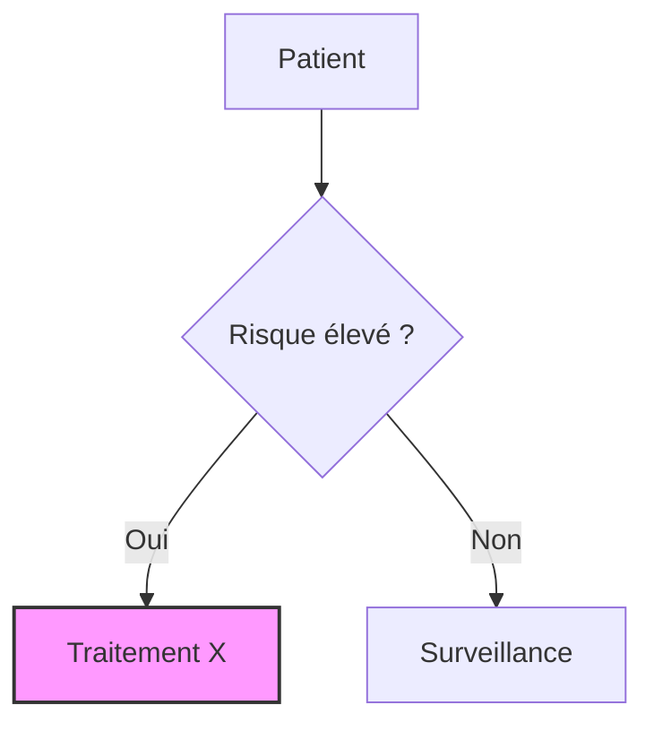
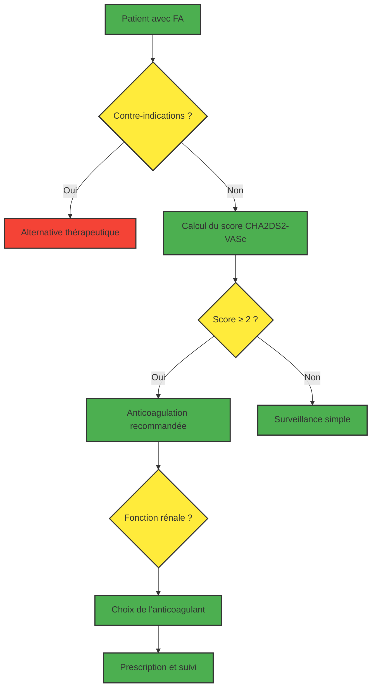
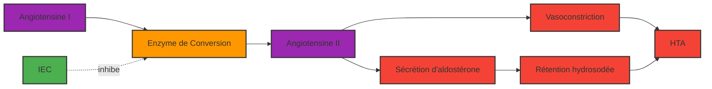
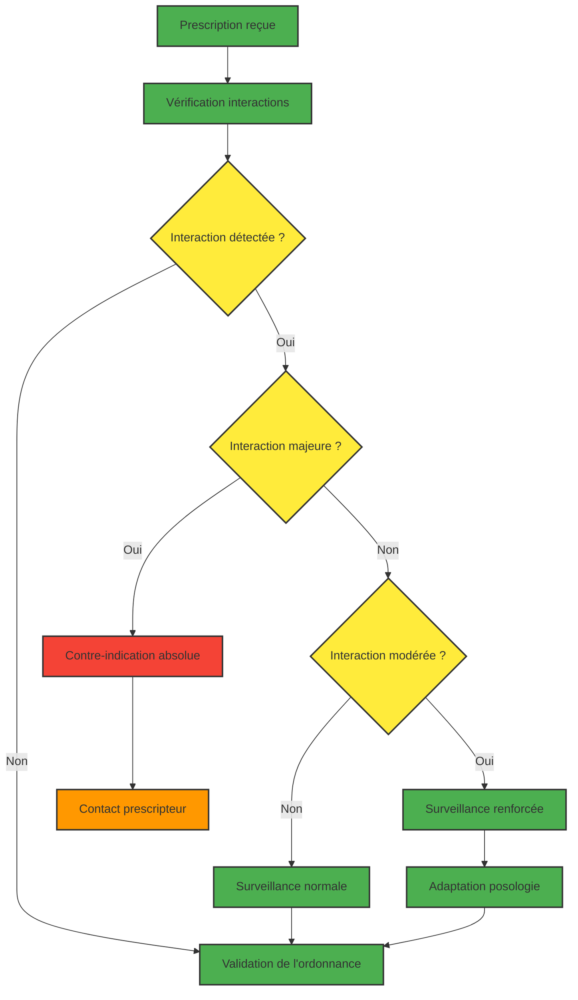
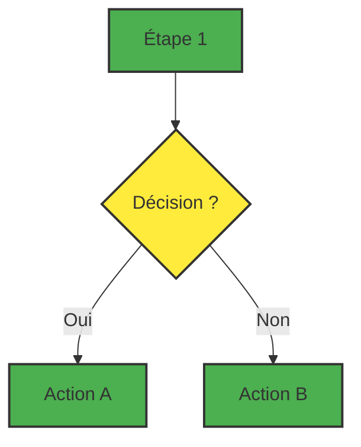
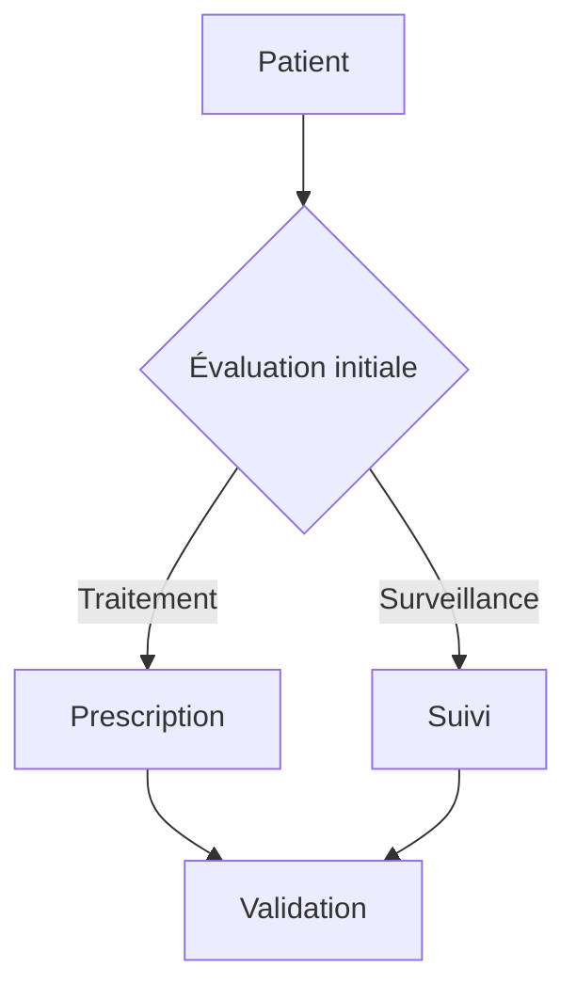

# Guide de Référence Mermaid : L'Art du Schéma en Texte

Ce guide se concentre sur les meilleures pratiques pour créer des diagrammes de flux clairs et maintenables avec la syntaxe Mermaid, directement depuis l'éditeur de l'application.

## Règle d'Or : La Syntaxe Moderne

Pour assurer la robustesse et la clarté de votre code, utilisez exclusivement la syntaxe moderne qui sépare l'identifiant de la mise en forme.

> `id_noeud@{ shape: "rectangle", label: "Texte du nœud" }`
> Cette méthode est plus lisible et moins sujette aux erreurs que les anciennes syntaxes.

## Anatomie d'un Diagramme

1. **Déclaration :** Toujours commencer par le type de diagramme et son orientation. `flowchart TD` (Top-Down) est le plus courant.
2. **Nœuds (Nodes) :** Ce sont les formes de votre diagramme. Chaque nœud doit avoir un identifiant unique.
3. **Liens (Links) :** Ce sont les flèches qui connectent les nœuds.

## Formes de Nœuds et leur Signification Sémantique

- `rectangle` : Une étape, une action, un processus.
- `losange (rhombus)` : Une décision, une question (oui/non).
- `stade (stadium)` : Début ou fin d'un processus.
- `cylindre (cylinder)` : Une base de données ou une source de données.
- `cercle (circle)` : Un point de jonction ou un événement mineur.

## Types de Liens pour la Pharmacologie

- `-->` : Lien standard (ex: "Molécule A -> Métabolite B").
- `-->|active|` : Lien d'activation.
- `--x|inhibe|` : Lien d'inhibition.
- `-.->` : Lien optionnel ou moins fréquent.

## Styling Propre avec `classDef`

Pour maintenir vos diagrammes lisibles, ne mettez pas de style directement sur les nœuds. Définissez des classes de style en haut de votre code et appliquez-les.



## Note Importante

L'application gère automatiquement la configuration visuelle (le bloc `%%{init:...}%%`). Vous ne devez **jamais** l'inclure dans votre code, cela causerait des erreurs.

## Exemples Pratiques pour la Pharmacie

### 1. Flux de Prescription d'Anticoagulants



### 2. Mécanisme d'Action des IEC



### 3. Algorithme de Gestion des Interactions



## Bonnes Pratiques

### 1. Nommage des Nœuds

- Utilisez des identifiants descriptifs : `patient_entree`, `verification_interactions`, `prescription_validee`
- Évitez les identifiants génériques comme `a`, `b`, `c`

### 2. Structure du Code



### 3. Commentaires

Utilisez `%%` pour ajouter des commentaires explicatifs dans votre code :



## Erreurs Courantes à Éviter

### 1. Identifiants Dupliqués

```mermaid
%% ❌ Incorrect
flowchart TD
    A[Patient] --> A[Diagnostic];

%% ✅ Correct
flowchart TD
    A[Patient] --> B[Diagnostic];
```

### 2. Liens Incorrects

```mermaid
%% ❌ Incorrect
flowchart TD
    A --> B{Question ?};
    B --> C[Réponse A];
    B --> D[Réponse B];

%% ✅ Correct
flowchart TD
    A --> B{Question ?};
    B -- Oui --> C[Réponse A];
    B -- Non --> D[Réponse B];
```

### 3. Styles Incohérents

```mermaid
%% ❌ Incorrect - Styles mélangés
flowchart TD
    A[Patient] --> B{Contre-indication ?};
    B --> C[Traitement];
    B --> D[Alternative];

%% ✅ Correct - Styles cohérents
flowchart TD
    classDef decision fill:#ffeb3b,stroke:#333,stroke-width:2px;
    classDef action fill:#4caf50,stroke:#333,stroke-width:2px;

    A[Patient] --> B{Contre-indication ?};
    B --> C[Traitement];
    B --> D[Alternative];

    class B decision;
    class A,C,D action;
```

## Conseils d'Optimisation

### 1. Limitez le Nombre de Nœuds

Un diagramme avec plus de 15-20 nœuds devient difficile à lire. Divisez les processus complexes en plusieurs diagrammes.

### 2. Utilisez des Couleurs Significatives

- **Jaune** : Décisions et points de contrôle
- **Vert** : Actions et processus
- **Rouge** : Risques et alertes
- **Orange** : Avertissements et surveillances

### 3. Testez Votre Code

Toujours tester votre diagramme Mermaid avant de l'intégrer dans vos documents. L'éditeur de l'application vous permet de prévisualiser en temps réel.

## Conclusion

Mermaid transforme la création de diagrammes d'un exercice graphique complexe en une activité de programmation simple et efficace. En maîtrisant ces bonnes pratiques, vous créez des schémas clairs, maintenables et professionnels qui enrichissent vos supports de révision.

Rappelez-vous : un bon diagramme Mermaid n'est pas juste visuellement attrayant, il est **sémantiquement correct** et **facilement modifiable**.
